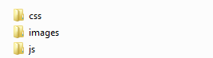
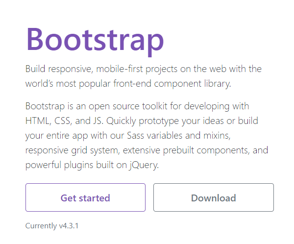
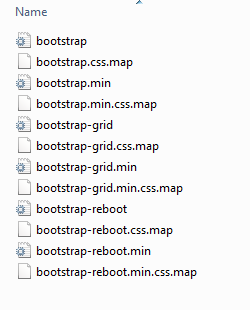

## Persiapan Membuat Landing Page

Sekarang kita akan mulai membuat landing page pertama kita. Sebelumnya kita akan mempersiapkan folder, menyiapkan halaman HTML dan juga mendownload ataupun menautkan Bootstrap 4, berikut langkah-langkahnya :

1. Buat folder untuk menyimpan file-file program dan file pendukung lainnya. Buat folder **images**, **css**, dan **js**. 

   

2. Buat file html, misalkan kita beri nama **index.html**.

3. Di dalam **index.html** tersebut, siapkan kerangka html terlebih dahulu.

   Kita akan membuat sebuah kerangka HTML seperti landing page pada umumnya, yaitu kita mulai dari **header**, **navigasi**, beberapa **section** seperti banner, informasi produk, informasi perusahaan dan lain-lain yang kita butuhkan lalu ditutup dengan **footer**.

   ```html
   <!DOCTYPE html>
   <html lang="en">
       <head>
           ...     
       </head>
       <body>
        <!--Navigasi Bar-->
         <nav class="navbar">
         ...
       </nav>
   
       <!--Header-->
       <header class="jumbotron">
           ...
       </header>
   
       <!--Service-->
       <section id="services">
           ...
       </section>
   
       <!--Product-->
       <section id="product">
       ...
       </section>
   
       <!--About-->
       <section id="about">
       ...
       </section>
   
       <!--Contact-->
       <section id="contact">
       ...
       </section>
   
       <!--Footer-->
       <footer>
       ...
       </footer>
   </html>
   ```

   

4. Setelah itu set up bootstrapnya. Source Bootstrap 4 terdiri dari file-file **CSS** dan **Javascript** yang nantinya dapat kita pasang di website kita.

   Untuk menggunakan file **CSS** dan **javascript** tersebut kita bisa mendownload maupun menggunakan **Bootstrap CDN** dengan cara menautkan link yang sudah sediakan ke halaman website kita.

   -  **Download Bootsrap 4**

     Pertama untuk mendownload Bootstrap 4, kita bisa mengunjugi website  https://getbootstrap.com  lalu klik tombol **Download**.

     

     Setelah mendownloadnya, kita bisa mengekstrak dan menempatkan file **css** dan **js** tersebut ke dalam file proyek (website) kita.

     Berikut contoh file **css** yang sudah kita ektrak di **folder css.**

     

     Setelah itu kita bisa memanggil file **css** dan **js** tersebut ke masing-masing halaman website kita.

     Contoh :

     **css**

     ```css
     <link rel="stylesheet" href="css/bootstrap.min.css">
     ```

     **js**

     ```html
     <script src="js/bootstrap.min.js"></script>
     ```

   - **Bootstrap CDN**

     Jika kita enggan mendownload, kita bisa juga menggunakan **Bootstrap CDN**, yaitu dengan memasang  link **CSS** dan **JS** yang sudah disediakan Bootstrap 4 pada halaman html yang kita buat.

     **css**

     ```html
     <link rel="stylesheet" href="https://stackpath.bootstrapcdn.com/bootstrap/4.4.1/css/bootstrap.min.css" integrity="sha384-Vkoo8x4CGsO3+Hhxv8T/Q5PaXtkKtu6ug5TOeNV6gBiFeWPGFN9MuhOf23Q9Ifjh" crossorigin="anonymous">
     ```

     **js**

     ```html
     <script src="https://code.jquery.com/jquery-3.4.1.slim.min.js" integrity="sha384-J6qa4849blE2+poT4WnyKhv5vZF5SrPo0iEjwBvKU7imGFAV0wwj1yYfoRSJoZ+n" crossorigin="anonymous"></script>
     
     <script src="https://cdn.jsdelivr.net/npm/popper.js@1.16.0/dist/umd/popper.min.js" integrity="sha384-Q6E9RHvbIyZFJoft+2mJbHaEWldlvI9IOYy5n3zV9zzTtmI3UksdQRVvoxMfooAo" crossorigin="anonymous"></script>
     
     <script src="https://stackpath.bootstrapcdn.com/bootstrap/4.4.1/js/bootstrap.min.js" integrity="sha384-wfSDF2E50Y2D1uUdj0O3uMBJnjuUD4Ih7YwaYd1iqfktj0Uod8GCExl3Og8ifwB6" crossorigin="anonymous"></script> 
     
     ```

5. Tambahkan style dasar.

   Pada sesi ini kita bisa menentukan style-style dasar yang akan kita gunakan untuk landing page yang akan kita buat, kalian bisa tambahkan style dasar sesuai kebutuhan kalian. Sebaiknya tentukan style seringan mungkin dan sebisa mungkin menggunakan style bawaan dari bootstrap.

   ```css
   <style>
   body
   {
       padding-top: 56px;
   }
   .jumbotron
   {
       background-color:cadetblue;
   }
   </style>
   ```

   Nah untuk sementara halaman index.html menjadi seperti berikut ini.

   ```html
   <!DOCTYPE html>
   <html lang="en">
       <head>
            <!-- Bootstrap CSS -->
           <link rel="stylesheet" href="https://stackpath.bootstrapcdn.com/bootstrap/4.4.1/css/bootstrap.min.css" integrity="sha384-Vkoo8x4CGsO3+Hhxv8T/Q5PaXtkKtu6ug5TOeNV6gBiFeWPGFN9MuhOf23Q9Ifjh" crossorigin="anonymous">  
           <style>
           body
           {
               padding-top: 56px;
           }
           .jumbotron
           {
      		 background-color:cadetblue;
           }
           </style>
       </head>
       <body>
        <!--Navigasi Bar-->
         <nav class="navbar">
         ...
       </nav>
   
       <!--Header-->
       <header class="jumbotron">
           ...
       </header>
   
       <!--Service-->
       <section id="services">
           ...
       </section>
   
       <!--Product-->
       <section id="product">
       ...
       </section>
   
       <!--About-->
       <section id="about">
       ...
       </section>
   
       <!--Contact-->
       <section id="contact">
       ...
       </section>
   
       <!--Footer-->
       <footer>
       ...
       </footer>
         <!-- jQuery first, then Popper.js, then Bootstrap JS -->
       <script src="https://code.jquery.com/jquery-3.4.1.slim.min.js" integrity="sha384-J6qa4849blE2+poT4WnyKhv5vZF5SrPo0iEjwBvKU7imGFAV0wwj1yYfoRSJoZ+n" crossorigin="anonymous"></script>
       <script src="https://cdn.jsdelivr.net/npm/popper.js@1.16.0/dist/umd/popper.min.js" integrity="sha384-Q6E9RHvbIyZFJoft+2mJbHaEWldlvI9IOYy5n3zV9zzTtmI3UksdQRVvoxMfooAo" crossorigin="anonymous"></script>
       <script src="https://stackpath.bootstrapcdn.com/bootstrap/4.4.1/js/bootstrap.min.js" integrity="sha384-wfSDF2E50Y2D1uUdj0O3uMBJnjuUD4Ih7YwaYd1iqfktj0Uod8GCExl3Og8ifwB6" crossorigin="anonymous"></script>
   </html>
   ```

   

