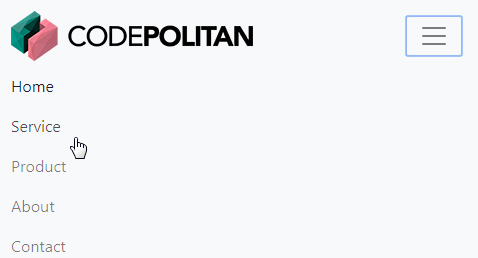

## Membuat Navigasi Bar

Sebelum melanjutkan ke pembahasan pokok, pastikan terlebih dahulu kalian sudah mengerti dasar-dasar **HTML**, **CSS**, **Bootstrap** dan juga **javascript** agar lebih mudah dalam mengikuti step by stepnya.

Pada bagian ini kita akan membuat **navigasi bar**, dimana navigasi bar ini akan menampilkan menu-menu yang responsif dan juga menampilkan **logo**.

Mula-mula buat baris kode seperti berikut ini : 

```html
<nav class="navbar navbar-expand-lg navbar-light bg-light fixed-top">


</nav>
```

**Keterangan** :

- `nav` membutuhkan sebuah wadah dalam hal ini kita menggunakan **class** **`navbar`** dan juga **class** **`navbar-expand-lg`**, di sini kita mnggunakan **large** atau `-lg`, kalian bisa menyesuaikan dengan kebutuhan kalian, yaitu dengan mengubahnya menjadi `-sm` untuk **small**, `-md` untuk **medium**, atau `-xl` untuk `xtra large`.
- Setelah itu kita bisa mengatur skema warna untuk navbar ini, yaitu dengan menambahkan **class** `navbar-light`  untuk warna background terang atau `navbar-dark` untuk warna background gelap. 
- Untuk memberikan warna background atau latar belakang , kalian bisa menggunakan **class** `bg-*`, tanda `*` dapat kalian ubah dengan `light`, `dark`, `primary` contoh `bg-light`,  `bg-dark`, `bg-primary`. Kalian bisa mengubah **class** warna sesuai keinginan, untuk **class-class** warna kalian bisa melihat dokumentasi tentang **color** di web resmi bootstrap.
- **Class** `fixed-top` kita gunakan agar navbar ini tetap berada di bagian atas walaupun kita melakukan scroll ke bawah.

Setelah itu kita buat sebuah elemen `<div>` dengan **class** `container` untuk membungkus **logo** dan juga menu-menu.

```html
<nav class="navbar navbar-expand-lg navbar-light bg-light fixed-top">
     <div class="container">
        ......  
      </div>
</nav>
```

Setelah itu kita bisa tambahkan logo di dalam elemen `div` dengan class `container` seperti di bawah ini.

```html
<a class="navbar-brand" href="#"></a>
```

Untuk logo di atas, kita menggunakan **class** bawaan dari **bootstrap 4** yaitu `navbar-brand`. 

Kode untuk navbar kita menjadi sebagai berikut :

```html
<nav class="navbar navbar-expand-lg navbar-light bg-light fixed-top">
     <div class="container">
		<a class="navbar-brand" href="#"></a>
	</div>
</nav>
```

Setelah menampilkan logo, tambahkan sebuah **button** untuk ditampilkan ketika layar beralih ke yang lebih kecil.

```html
<button class="navbar-toggler" type="button" data-toggle="collapse" 
           data-target="#navbarContent" aria-controls="navbarContent" 
           aria-expanded="false" aria-label="Toggle navigation">
           <span class="navbar-toggler-icon"></span>
</button>              
```

Setelah itu di bawah button kita buat elemen `<div>` untuk membungkus navbarnya. 

```html
<div class="collapse navbar-collapse" id="navbarContent">
  
  
  
</div>
```

**Catatan :**

- Untuk elemen `<div>` ini kita menggunakan **class** bawaan dari **bootstrap 4** yaitu menggunakan **class** `.collapse` diikuti dengan `navbar-collapse`.

- class .`collapse` `navbar-collapse`.digunakan untuk mengelompokkan dan menyembunyikan elemen navbar ketika beralih media atau layar.

- **id** `navbarContent` disamakan dengan `data-target` pada elemen `button`.

  

  Setelah itu kita mulai membuat elemen-elemen menu seperti di bawah ini.

  ```html
  <ul class="navbar-nav ml-auto">
         <li class="nav-item active">
            <a class="nav-link" href="#">Home</a>
          </li>
          <li class="nav-item">
              <a class="nav-link" href="#services">Service</a>
          </li>
           <li class="nav-item">
              <a class="nav-link" href="#product">Product</a>
           </li>
            <li class="nav-item">
                <a class="nav-link" href="#about">About</a>
             </li>
             <li class="nav-item">
                 <a class="nav-link" href="#contact">Contact</a>
             </li>
    </ul>
  ```

**Catatan** :

  - `ml-auto` adalah margin left dibuat **auto**, menyesuaikan lebar text.
  - **class** elemen `<li>` kita menggunakan class bawaan bootstrap yaitu `nav-item` dan untuk elemen `<a>` kita juga menggunakan class bawaan bootstrap `nav-link`.

  Kode untuk navigasi bar menjadi seperti berikut ini :

```html
 <!--Navigasi bar-->
<nav class="navbar navbar-expand-lg navbar-light bg-light fixed-top">
    <div class="container">
         <a class="navbar-brand" href="#"></a>
       	 <button class="navbar-toggler" type="button" data-toggle="collapse" data-target="#navbarContent" aria-controls="navbarContent" aria-expanded="false" aria-label="Toggle navigation">
        	<span class="navbar-toggler-icon"></span>
        </button>  
        <div class="collapse navbar-collapse" id="navbarContent">
           <ul class="navbar-nav ml-auto">
              <li class="nav-item active">
                  <a class="nav-link" href="#">Home</a>
               </li>
               <li class="nav-item">
                   <a class="nav-link" href="#services">Service</a>
               </li>
               <li class="nav-item">
                  <a class="nav-link" href="#product">Product</a>
               </li>
               <li class="nav-item">
                  <a class="nav-link" href="#about">About</a>
               </li>
               <li class="nav-item">
                  <a class="nav-link" href="#contact">Contact</a>
               </li>
            </ul>
       </div>
  </div>
</nav>
```


Hasil dari navigasi bar kita seperti berikut ini, gambar di bawah ini tampilan navigasi bar ketika dibuka di layar yang berukuran besar atau desktop.


  

  Sedangkan ketika dibuka di layar berukuran kecil akan tampil seperti berikut ini.

  


