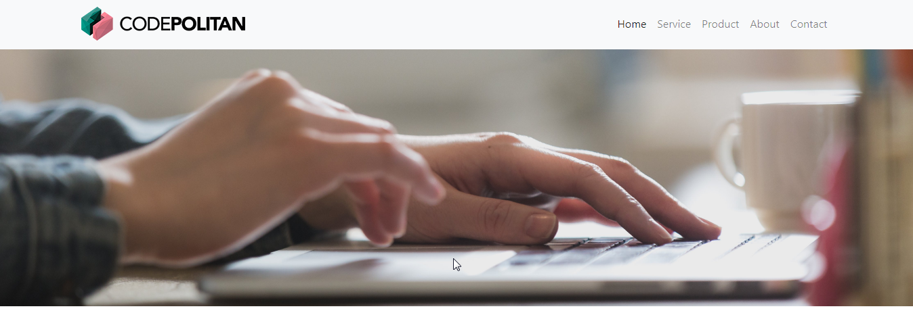
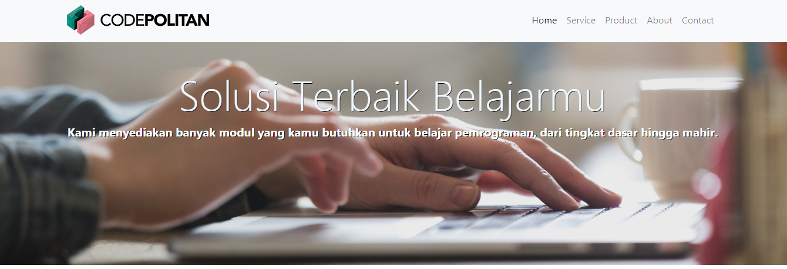
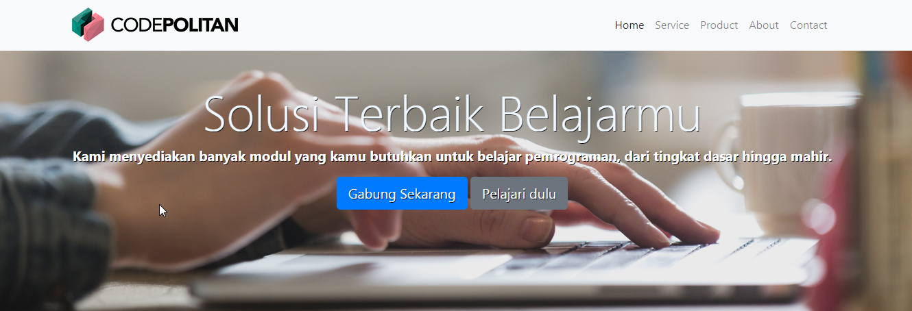
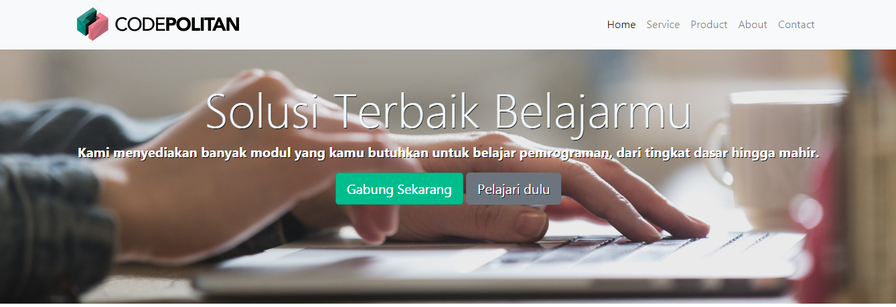

Sebelumnya kita sudah membuat navigasi bar, sekarang kita akan melanjutkan pembuatan headline yang akan kita kemas dalam jumbotron.

## Membuat Headline dengan Jumbotron

Mula-mula kita bisa menggunakan elemen `<header>` atau elemen `<section>` , seperti berikut ini.

```html
<header class="jumbotron">

</header>
```

atau

```html
<section class="jumbotron">

</section>
```

Sekarang kita tambahkan class `jumbotron-fluid` dan `background-header` pada `section` tersebut.

```html
<section class="jumbotron jumbotron-fluid background-header">

</section>
```


**Class** `jumbotron-fluid` merupakan bawaan dari class Bootstrap 4 , yaitu class ini akan mengatur style agar **jumbotron** menempati seluruh ruang horizontal induknya.

Sedangkan **class** `background-header` kita harus membuat stylenya terlebih dahulu.

```css
.background-header
{
  background-image: url("images/banner2.jpg");
  background-color: #fafbfc;
  height: 400px;
  background-position: center;
  background-repeat: no-repeat;
  background-size: cover;
  position: relative;
}
```

Style di atas akan menampilkan sebuah gambar dengan nama **banner2.jpg** yang berada di folder images, gambar tersebut akan ditampilkan setinggi 400px dan dengan ukuran gambar `cover` yaitu gambar akan menutupi seluruh wadah (dalam hal ini elemen `section` atau `header`).

Berikut tampilan sementara :




Setelah itu buat elemen `<div>` untuk membungkus **text**, tombol-tombol dan elemen lain di section ini.

Tambahkan class `container-fluid`  diikuti `text-center`.

```html
<section class="jumbotron jumbotron-fluid background-header">
    <div class="container-fluid text-center">
		
    </div>
</section>
```

Setelah itu tambahkan elemen-elemen yang dibutuhkan seperti judul, paragraf, tombol dan elemen lainnya.

Pertama kita buat judul dan paragraf yang menarik agar pengunjung langsung fokus ke headline kita.

**Contoh :**

```html
<h1 class="display-3">Solusi Terbaik Belajarmu</h1>
<p class="lead">Kami menyediakan banyak modul yang kamu butuhkan untuk belajar pemrograman, dari tingkat dasar hingga mahir.</p>
```

**Catatan :**

- `display-3` merupakan **class** bawaan dari bootstrap, kalian bisa cek mengenai **Display headings** di **typografi bootstrap**, jadi mirip elemen heading, makin kecil nilainya maka makin besar tampilannya, jadi misal `display-1` ini akan menampilkan ukuran lebih besar jika dibanding `display-2` dan seterusnya.

- Kalian bisa menambahkan style sendiri sesuai keinginan, misal mau ditambahkan style warna dll.

- class **lead** juga bawaan dari bootstrap dimana akan menghasilkan paragraf yang menonjol, coba ketika kita hilangkan class tsb, maka ukuran paragrafnya jadi lebih kecil  dan terkesan kurang menonjol atau kurang highlight/tersorot.

  **Contoh**

  ```html
  <h1 class="display-3" style="color:aliceblue; ">Solusi Terbaik Belajarmu</h1>
  <p class="lead" style="font-weight: bold;color:#fff;">Kami menyediakan banyak modul yang kamu butuhkan untuk belajar pemrograman, dari tingkat dasar hingga mahir.</p>
  ```

Kode menjadi seperti berikut :

```html
<section class="jumbotron jumbotron-fluid background-header">
    <div class="container-fluid text-center">
        <h1 class="display-3" style="color:aliceblue; ">Solusi Terbaik Belajarmu</h1>
         <p class="lead" style="font-weight: bold;color:#fff;">Kami menyediakan banyak modul yang kamu butuhkan untuk belajar pemrograman, dari tingkat dasar hingga mahir.</p>
     </div>
</section>
```

Tampilan sementara menjadi seperti berikut ini :



Sekarang kita buat tombol-tombol agar user melakukan **action** .

Untuk **class-class** tombol atau button kita bisa mengikuti class-class yang sudah disediakan oleh bootstrap, jadi kita tidak perlu susah susah untuk membuat style lagi.

**Contoh** 

```html
<a href="#" class="btn btn-primary btn-lg" role="button">Gabung Sekarang</a>
<a href="#" class="btn btn-secondary btn-lg" role="button">Pelajari dulu</a>
```

Hasilnya seperti berikut :




Namun jika kita kurang tertarik dengan class button yang disediakan oleh bootsrap , kita juga bisa membuat style sendiri.

**Contoh** 

Misal kita gunakan class dengan nama `button-primer`.

```html
<a href="#" class="btn button-primer btn-lg" role="button">Gabung Sekarang</a>
```

Setelah itu kita bisa membuat stylenya di bagian **css**.

```css
 .button-primer {
          background-color: #00bd8e;
          border-color : #0b9b6b;
          color        : #fff;
          text-shadow: 0px 0px;  
      }
	      .button-primer:hover {
          background-color: #038c6a;
          color        : #fff;
          text-shadow: 0px 0px;  
      }
```

Catatan : `btn-lg` merupakan bawaan dari bootstrap dimana button yang ditampilkan menjadi lebih besar.

Berikut kode untuk jumbotron :

```html
<section class="jumbotron jumbotron-fluid background-header">
    <div class="container-fluid text-center">
         <h1 class="display-3" style="color:aliceblue; ">Solusi Terbaik Belajarmu</h1>
         <p class="lead" style="font-weight: bold;color:#fff;">Kami menyediakan banyak modul yang kamu butuhkan untuk belajar pemrograman, dari tingkat dasar hingga mahir.</p>
         <a href="#" class="btn button-primer btn-lg" role="button">Gabung Sekarang</a>
         <a href="#" class="btn btn-secondary btn-lg" role="button">Pelajari dulu</a>
     </div>
</section>
```

Nah sekarang kita bisa cek hasilnya ya.




