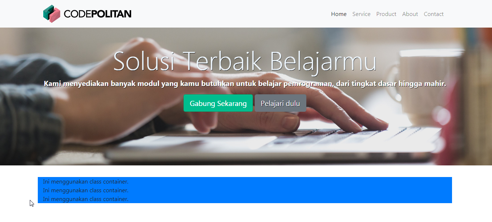

## Membuat kerangka section Service

Kali ini kita akan membahas tentang pembuatan **section** service.

Pertama-tama kita buat section dengan **id** `services`.

```html
<section id="services">
   
   
</section>
```

**Id** di sini kita isi sesuai dengan link yang kita isi di **navbar** untuk menu service. 

Setelah itu kita bisa menambahkan style dasar untuk `section` tersebut.

Misalkan kita tambahkan class `service-style`

```html
<section id="services" class="service-style">
   
   
</section>
```

Setelah itu kita atur stylenya.

```css
 .service-style
{
    margin-top: 15px;
    background-color: #fafbfc;
}
```

Setelah itu buat elemen `<div>` untuk membungkus semua elemen  yang akan kita tampilkan di **section** ini, seperti judul dan item-item service. 

Tambahkan class `container-fluid` diikuti `container-fluid-max`.

```html
<div class="container-fluid container-fluid-max">
    
</div>
```

Atau kalian bisa menempatkan **class** di dalam `section`, apabila hanya mempunyai satu `container` atau  `container-fluid` saja.

Seperti berikut ini :

```html
<section id="services" class="service-style container-fluid container-fluid-max">
   
   
</section>
```


Berikut perbedaan penggunaan `container`, `container-fluid`, `container-fluid-max` dan `container-fluid` diikuti `container-fluid-max`.

**Menggunakan Class `container`**



Dan perhatikan ketika kita zoom out maka tampilannya sebagai berikut ini :


**Menggunakan class `container-fluid`**


Dan perhatikan ketika kita zoom out maka tampilannya sebagai berikut ini :


**Menggunakan class `container-fluid-max`**


Dan perhatikan ketika kita zoom out maka tampilannya sebagai berikut ini :


**Menggunakan class `container-fluid` diikuti`container-fluid-max`**


Dan perhatikan ketika kita zoom out maka tampilannya sebagai berikut ini :


Nah kalian bisa sesuaikan kebutuhan ya untuk penggunaan **class** `container` ini.

Langkah selanjutnya buat lagi elemen `<div>` dengan class `row`  dan apabila ingin semua elemen di dalam elemen `div` ini rata tengah kita bisa gunakan **class** `text-center`.

```html
<div class="row text-center">
  ....                         
</div>
```

Untuk pembahasan **class** `container` dan juga `row`, kalian bisa mempelajari tentang sistem grid di Bootstrap yah.

Di dalam elemen `div` ini, kita akan buat judul dan item service yang akan kita tawarkan.

### Membuat Judul Menu Service

Pertama kita buat judul terlebih dahulu, kita bungkus judul dengan elemen `div` dan menambahkan **class** `col-12.`

Class `col-12` ini juga merupakan sistem grid yang disediakan ole bootstrap, dimana untuk sistem grid sendiri dibuat dengan menggunakan **flexbox** , dan memungkinkan hingga 12 kolom pada setiap halaman website. 

Jadi class `col-12` itu artinya kita mengatur kolom untuk judul ini adalah 12 atau ukuran penuh.

```html
<div class="col-12">
     <h2>Mengapa memilih kami? 
     </h2>
</div>
```

### Membuat Item Service

Sekarang kita buat item-item service atau keunggulan yang akan kita tawarkan.

Di sini kita akan menampilkan **icon-icon** yang menarik untuk mendukung penampilan menu ini.

Untuk menggunakan **icon**, pertama kali kita harus memuat **library** penyedia icon, contohnya seperti **font awesome**. Font Awesome menyediakan icon-icon bagus (tersedia free dan pro) yang dapat kita manfaatkan untuk pembuatan website kita.

**Menggunakan Icon dari Font Awesome 5** 

1. Kunjungi situs resminya di https://fontawesome.com/

2. Kalian bisa menggunakan **CDN** dengan menautkan link yang sudah disediakan.

   Kalian bisa mulai klik Tombol Start for Free dan ikuti langkah-langkahnya.
   
   
   

   
3. Untuk penggunaannya, kalian bisa membaca dokumentasi dari situs font awesome tersebut.


Setelah menautkan link CDN dari font awesome, sekarang kita mulai membuat item servicenya.

Buat elemen `<div>` untuk membungkus masing-masing service.

Lalu tambahkan class `.col-12` diikuti `.col-sm-6`  lalu `.col-lg-3.`, misalkan di sini kita ingin menampilkan 4 item service.

```html
<div class="col-12 col-sm-6 col-lg-3">
    
</div>
```

Buat konten yang akan kalian tampilkan di item service misalnya seperti berikut ini.

```html
<i class="fas fa-list-ol"></i>
<h3>Fasilitas Oke</h3>
<p>Lorem Ipsum is simply dummy text of the printing and typesetting industry.</p>  
```

Kode untuk masing-masing item service kita adalah sebagai berikut :

```html
<div class="col-12 col-sm-6 col-lg-3">
   <i class="fas fa-laptop-code"></i>
   <h3>Modul Lengkap</h3>
   <p>Lorem Ipsum is simply dummy text of the printing and typesetting industry.</p> </div>
```

Nah kalian bisa buat sejumlah item yang ingin ditampilkan.

Kode untuk Menu service sementara adalah sebagai berikut :

```html
<section id="services" class="service-style  container-fluid container-fluid-max " >
   <div class="row text-center">
       <div class="col-12">
          <h2>Mengapa memilih kami?</h2>
      	</div>
        <div class="col-12 col-sm-6 col-lg-3">
          <i class="fas fa-list-ol"></i>
          <h3>Fasilitas Oke</h3>
          <p>Lorem Ipsum is simply dummy text of the printing and typesetting industry.</p>  
         </div>
         <div class="col-12 col-sm-6 col-lg-3">
          	<i class="fas fa-laptop-code"></i>
            <h3>Modul Lengkap</h3>
            <p>Lorem Ipsum is simply dummy text of the printing and typesetting industry.</p>  
          </div>
           <div class="col-12 col-sm-6 col-lg-3">
             <i class="fas fa-money-bill"></i>
             <h3>Biaya Terjangkau</h3>
             <p>Lorem Ipsum is simply dummy text of the printing and typesetting industry.</p>  
           </div>
           <div class="col-12 col-sm-6 col-lg-3">
             <i class="fas fa-chart-line"></i>
              <h3>Terarah</h3>
            <p>Lorem Ipsum is simply dummy text of the printing and typesetting industry.</p>  
           </div>
     </div>        
</section>
```

Hasilnya seperti berikut ini : 


