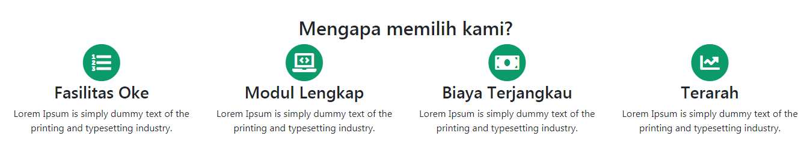

## Styling Service 

Setelah membuat kerangka dari item-item service, kali ini kita akan mempercantik tampilan dari item-item service ini.

Kita akan menambahkan icon lingkaran sebagai latar dari icon service.

Untuk menumpuk icon service di atas icon lingkaran, kita bisa gunakan elemen `<span>` dan tambahkan **class** `fa-stack` diikuti `fa-2x`.

```html
<span class="fa-stack fa-2x">
  
</span>
```

Di dalam elemen `<span>`, kita akan set icon lingkaran 2x lebih besar dari icon service maka kita tambahkan **class** `fa-stack-2x`.

```html
 <i class="fas fa-circle fa-stack-2x"></i>
```

Lalu untuk warna dari icon lingkaran hijau, kita bisa tambahkan class sendiri misal `text-green`.

```html
 <i class="fas fa-circle fa-stack-2x text-green"></i>
```

Kita buat style css untuk **class** `text-green` :

```css
.text-green
{
   color:#0b9b6b;
}
```

Setelah itu kita tambahkan **class** `fa-stack-1x`  pada masing-icon service dan kita set dengan **class** `text-white`.

```html
 <i class="fas fa-list-ol fa-stack-1x text-white"></i>

```

Jadi kode untuk icon service menjadi seperti berikut ini :

```html
<span class="fa-stack fa-2x">
    <i class="fas fa-circle fa-stack-2x text-green"></i>
    <i class="fas fa-laptop-code fa-stack-1x text-white"></i>
</span>
```

Terapkan kode di atas pada masing-masing icon service.

Nah setelah itu kita bisa tambahkan judul untuk item service dan juga deskripsinya.

```html
<h3 class="mt-3 text-green h4">Fasilitas Oke</h3>
  <p>Lorem Ipsum is simply dummy text of the printing and typesetting industry.    </p>    
```

Kode untuk menu service kita sementara adalah sebagai berikut :

```html
<section id="services" class="service-style  container-fluid container-fluid-max " >
    <div class="row text-center">
        	<div class="col-12">
             	<h2>Mengapa memilih kami?</h2>
          	</div>
          	<div class="col-12 col-sm-6 col-lg-3">
                <span class="fa-stack fa-2x">
                    <i class="fas fa-circle fa-stack-2x text-green"></i>
                    <i class="fas fa-list-ol fa-stack-1x text-white"></i>
                </span>
                 <h3>Fasilitas Oke</h3>
                 <p>Lorem Ipsum is simply dummy text of the printing and typesetting industry.</p>  
          	</div>
         	<div class="col-12 col-sm-6 col-lg-3">
                 <span class="fa-stack fa-2x">
                      <i class="fas fa-circle fa-stack-2x text-green"></i>
                      <i class="fas fa-laptop-code fa-stack-1x text-white"></i>
                  </span>
                  <h3>Modul Lengkap</h3>
                  <p>Lorem Ipsum is simply dummy text of the printing and typesetting industry.</p>  
            </div>      
           	<div class="col-12 col-sm-6 col-lg-3">
             	<span class="fa-stack fa-2x">
                   <i class="fas fa-circle fa-stack-2x  text-green"></i>
                   <i class="fas fa-money-bill fa-stack-1x text-white"></i>
               	</span>
                <h3>Biaya Terjangkau</h3>
                <p>Lorem Ipsum is simply dummy text of the printing and typesetting industry.</p>  
           </div>
           <div class="col-12 col-sm-6 col-lg-3">
               <span class="fa-stack fa-2x">
                  <i class="fas fa-circle fa-stack-2x  text-green"></i>
                   <i class="fas fa-chart-line fa-stack-1x text-white"></i>
               </span>
               <h3>Terarah</h3>
               <p>Lorem Ipsum is simply dummy text of the printing and typesetting industry.</p>  
           </div>
         </div>        
</section>
```

Hasilnya seperti berikut ini :

