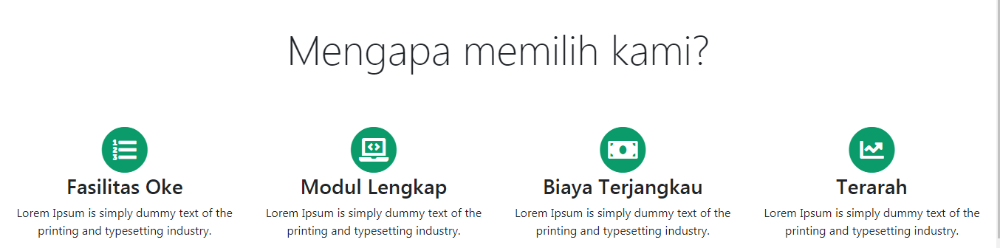
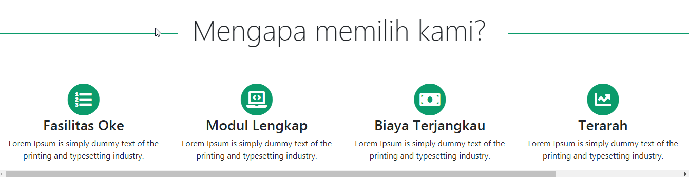

## Styling Judul Menyu

Sekarang kita akan mengatur style untuk judul-judul dari menu, termasuk menu service ini.

Untuk mengatur jarak bawah pada sisi dalam dari judul ini kita tambahkan class **`pb-4`** yang artinya **padding bottom** nya kita atur dengan **`pb-4`** (cek tentang spacing di bootstrap).

```html
<div class="col-12 pb-4">
     <h2>Mengapa memilih kami? 
     </h2>
</div>
```

Untuk mempercantik tampilan dari judul, kita bisa menambahkan **class** ataupun style yang kita inginkan. 

Kita tambahkan **class** `display-4` dimana ini merupakan **class** bawaan bootstrap untuk typografi, lalu kita atur letak teksnya misal di tengah, maka tambahkan class  `text-center`, lalu kita bisa mengatur jarak dengan margin misal dengan `mb-5` dan `mt-3`.

```html
<div class="col-12 pb-4">
     <h2 class="display-4 text-center mb-5">Mengapa memilih kami? 
     </h2>
</div>
```

Sekarang tampilannya menjadi sebagai berikut :




Selanjutnya kita bisa menambahkan style khusus untuk `h2` , di sini saya ingin menampilkan garis untuk menghiasi judul menu kita.

```css
h2:before,
h2:after {
 background-color: #0b9b6b;
 content: "";
 display: inline-block;
 height: 1px;
 position: relative;
 vertical-align: middle;
 width: 50%;
}
h2:before {
 right: 0.5em;
 margin-left: -50%;
}
h2:after {
 left: 0.5em;
 margin-right: -50%;
}
```

Perhatikan `width` pada `h2:before` , `h2:after`, di situ kita set 50%, untuk judul-judul yang panjang akan mempengaruhi lebar layar. Apabila judul yang kalian tuliskan cukup panjang dan mengakibatkan tampilan bergeser, kalian harus mengatur kembali seperti mengecilkan prosentase atau melakukan styling lainnya. 

Tampilan menjadi seperti berikut ini :



