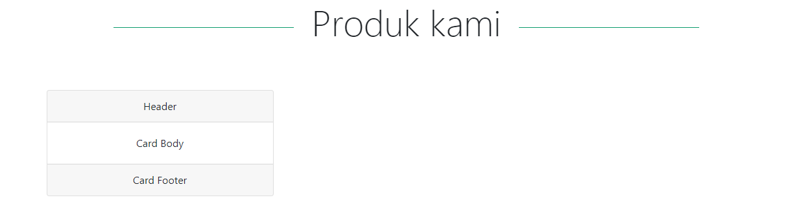

## Membuat Kerangka Section Product

Sebelumnya kita sudah membuat  **headline**  dan juga section **service**, sekarang kita akan membuat section atau menu **product**.

Pada elemen `section` ini kita tambahkan **class** `container`.

```html
<section id="product" class="container">
   
   
</section>
```

**Id** di sini kita isi sesuai dengan link yang kita isi di navbar untuk menu Product yaitu `product`. 

Jadi ketika kita klik menu **product**, maka akan meload `section` dengan `id` product.

Setelah itu kita buat elemen `<div>` dan kita atur classnya  `row` , kemudian saya ingin semua elemen yang ada di dalam elemen .`div` ini rata tengah, maka saya gunakan **class** `text-center`.

```html
<section id="product">
   <div class="row text-center">
   
   
    </div>
</section>
```

Untuk judulnya, kita samakan class dan stylenya dengan section sebelumnya.

```html
<div class="col-12 pb-4">
   <h2 class="display-4 text-center mb-5">Produk kami</h2>
</div>
```

Kemudian kita buat masing-masing productnya dengan menggunakan class **Cards** yang sudah disediakan oleh bootstrap.

Sebelumnya elemen untuk **cards** tersebut kita bungkus dengan elemen `div` dan  tambahkan **class** `.col-md-4`  dan atur margin bottom (spacing).

```html
<div class="col-md-4 mb-4">
   

    
</div>
```

Untuk **cards** sendiri kita buat dengan elemen `div` lalu atur **class** dengan `card`,

```html
<div class="col-md-4 mb-4">
   <div class="card">
       
   </div>
</div>
```


Buat kerangka elemen card, misalnya kita buat card header dengan menambahkan **class** `card-header`, card body dengan menambahkan **class**  `card-body` dan card footer dengan menambahkan **class** `card-footer`.

```html
<div class="col-md-4 mb-4">
   <div class="card">
      <div class="card-header">
         Header
       </div>
       <div class="card-body">
		 Card Body	
		</div>
		<div class="card-footer">
		Card Footer
		</div>
   </div>
</div>
```

Kode untuk section product kita menjadi seperti di bawah ini :

```html
<section id="product" class="container">
  <div class="row text-center">
     <div class="col-12 pb-4">
        <h2 class="display-4 text-center mb-5">Produk kami</h2>
     </div>
     <div class="col-md-4 mb-4">
       <div class="card">
         <div class="card-header">
           Header
         </div>
         <div class="card-body">
           Card Body	
          </div>
          <div class="card-footer">
             Card Footer
          </div>
       </div>
     </div>
  </div>
</section>
```

Hasil dari card di atas adalah sebagai berikut :


