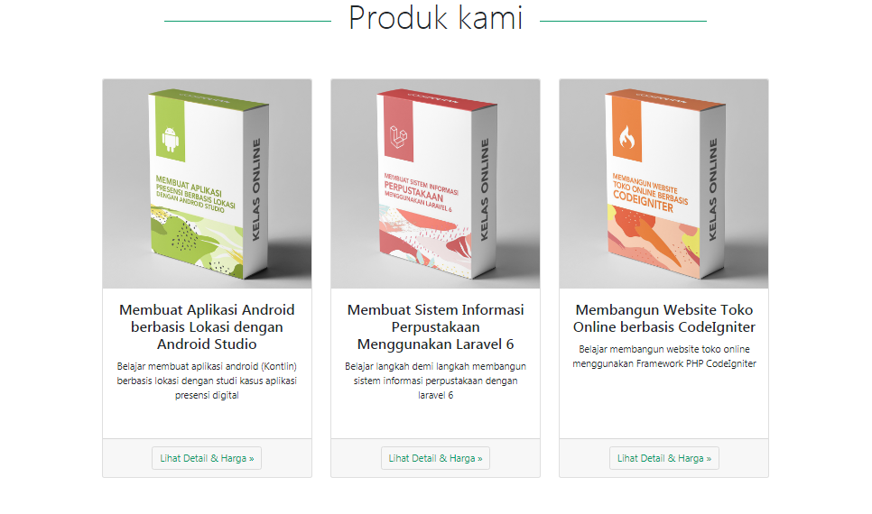

## Syling card untuk produk

Setelah membuat kerangka card,  kita bisa tambahkan elemen `` untuk menampilkan gambar , kita tambahkan class `card-img-top` untuk menempatkan kartu di bagian atas kartu.

```html

```

Kita bisa hapus card-header terlebih dahulu, karena untuk saat ini kita belum menggunakannya.

Kode untuk Card menjadi seperti berikut ini :

```html
<div class="card">
   
     <div class="card-body">
         Card Body	
      </div>
      <div class="card-footer">
         Card Footer
      </div>
</div>
```

Setelah itu kita bisa buat nama produk dan deskripsi produk di dalam `card-body`.

Pertama kita tambahkan nama produknya terlebih dahulu, untuk nama produk kita bisa menggunakan **class** `card-title`

```php+HTML
<h4 class="card-title">Membuat Aplikasi Android berbasis Lokasi dengan Android Studio</h4>
```

Setelah itu kita tambahkan deskripsinya dengan menggunakan **class** `card-text`.

```html
 <p class="card-text">Belajar membuat aplikasi android (Kontlin) berbasis lokasi dengan studi kasus aplikasi presensi digital</p>
```

Kemudian buat tombol di dalam `card-footer`.

```html
<div class="card-footer">
    <a href="#" class="btn button-sekunder">Lihat Detail & Harga &raquo;</a>
</div>
```

Kode untuk Card menjadi seperti berikut ini :

```html
 <div class="card">
    
     <div class="card-body">
        <h4 class="card-title">Membuat Aplikasi Android berbasis Lokasi dengan Android Studio</h4>
        <p class="card-text">Belajar membuat aplikasi android (Kontlin) berbasis lokasi dengan studi kasus aplikasi presensi digital</p>   
      </div>
      <div class="card-footer">
          <a href="#" class="btn button-sekunder">Lihat Detail & Harga &raquo;</a>
      </div>
</div>
```

Untuk menyamakan tinggi setiap card dengan panjang deskripsi yang berbeda, kita bisa tambahkan style **"min-height:250px"** pada     `<div class="card-body">` seperti berikut ini :

```html
<div class="card">
  
   <div class="card-body " style="min-height:250px">
    	<h4 class="card-title">Membuat Aplikasi Android berbasis Lokasi dengan Android Studio</h4>
        <p class="card-text">Belajar membuat aplikasi android (Kontlin) berbasis lokasi dengan studi kasus aplikasi presensi digital</p>        
   </div>
   <div class="card-footer">
      <a href="#" class="btn button-sekunder">Lihat Detail & Harga &raquo;</a>
   </div>
</div>
```

Buat style untuk `button-sekunder`.

```css
      .button-sekunder {
          background-color: transparent;
          border-color: #dbdbdb;
          color: #0b9b6b;
      } 
  .button-sekunder:hover {
          background-color: #0b9b6b;
          border-color: #dbdbdb;
          color: #fff;
      }
```

Ulangi skript di atas, sebanyak produk yang kita punya, dan ubah gambar, nama dan deskripsi produk sesuai dengan produk yang akan kita tampilkan.

Hasilnya menjadi seperti di bawah ini :



Berikut kode lengkap untuk section product :

```html
<section id="product" class="container">
   <div class="row text-center">
      <div class="col-12 pb-4">
         <h2 class="display-4 text-center mb-5">Produk kami</h2>
      </div>
       <!--Produk Pertama -->
      <div class="col-md-4 mb-4">
      	<div class="card">
         
         <div class="card-body" style="min-height:250px">
           <h4 class="card-title">Membuat Aplikasi Android berbasis Lokasi dengan Android Studio</h4>
           <p class="card-text">Belajar membuat aplikasi android (Kontlin) berbasis lokasi dengan studi kasus aplikasi presensi digital</p>
              
        </div>
        <div class="card-footer">
           <a href="#" class="btn button-sekunder">Lihat Detail & Harga &raquo;</a>
        </div>
      </div>
  	 </div>  
       
     <!--Produk Kedua -->
     <div class="col-md-4 mb-4">
        <div class="card">
          
          <div class="card-body" style="min-height:250px">
            <h4 class="card-title">Membuat Sistem Informasi Perpustakaan Menggunakan Laravel 6</h4>
             <p class="card-text">Belajar langkah demi langkah membangun sistem informasi perpustakaan dengan laravel 6</p>      
         </div>
         <div class="card-footer">
            <a href="#" class="btn button-sekunder">Lihat Detail & Harga &raquo;</a>
          </div>
        </div>
    </div>
    <!--Produk Ketiga -->
   <div class="col-md-4 mb-4">
     <div class="card">
       
       <div class="card-body" style="min-height:250px">
          <h4 class="card-title">Membangun Website Toko Online berbasis CodeIgniter</h4>
          <p class="card-text">Belajar membangun website toko online menggunakan Framework PHP CodeIgniter</p>
        </div>
        <div class="card-footer">           
          <a href="#" class="btn button-sekunder">Lihat Detail & Harga &raquo;</a>
        </div>
      </div>
    </div>
  </div>
</section>
```

