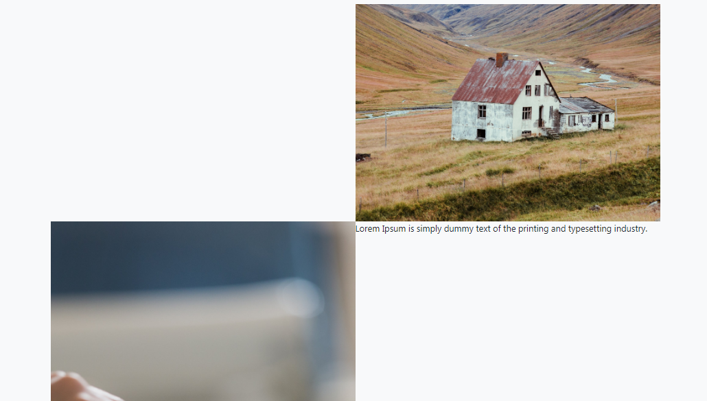

## Membuat Kerangka Menu About Us

Sebelumnya kita sudah membuat **navbar**, **headline**, section **service** dan section **product**, nah sekarang kita akan buat section **about us**.

Section about kita akan buat selang seling antara deskripsi dan foto.

Pada section ini kita tambahkan **class** `bg-light` dan `container` atau  `container-fluid` diikuti `container-fluid-max` (perbedaannya sudah dibahas di pembuatan menu service).

Atau kalian juga bisa menempatkan class container tersebut di sebuah elemen `<div>` seperti di bawah.

```html
<section id="about"  class="bg-light container">

</section>
```

atau

```html
<section id="about"  class="bg-light">
    <div class="container">
   
   
   <div>
</section>
```

Setelah itu buat judul menu,  kita samakan dengan style pada judul menu service dan product, yaitu menggunakan elemen `<h2>` yang sudah kita atur stylenya.

```html
<h2 class="display-4 text-center mb-5">Tentang kami </h2>

```


Setelah itu kita buat elemen `<div>` dan kita atur classnya  `row`.

```html
<section id="about"  class="bg-light">>
    <div class="container">
     <h2 class="display-4 text-center mb-5">Tentang kami </h2>
     <div class="row">


     <div>
   <div>
</section>
```

Untuk membuat teks dan gambar pertama, kita bisa gunakan sistem **grid** yaitu dengan membagi 12 kolom menjadi 2, sehingga seperti berikut ini.

```html
<!--text pertama-->
<div class="col-12 col-md-6">
      
</div>
<!--gambar pertama-->
<div class="col-12 col-md-6">
    
</div>
```

Misal kita tambahkan text di dalam elemen `div` untuk text pertama ini.

Dan juga tambahkan gambar di dalam elemen div untuk gambar pertama.

```html
<section id="about"  class="bg-light">>
   <div class="container">
      <h2 class="display-4 text-center mb-5" style="margin-top: 5rem!important;">Tentang kami </h2>  
      <div class="row">
          <!--gambar & text pertama-->
         <div class="col-12 col-md-6">
              Lorem Ipsum is simply dummy text of the printing and typesetting industry.
         </div>
         <div class="col-12 col-md-6">
            <div class=" vh-100" style="background-image: url('images/banner3.jpg');"></div>
           </div>
          <!--gambar & teks kedua-->
         </div>  
    </div>    
 </section>
```

**catatan** : **vh-100** merupakan class bawaan bootstrap tentang Sizing, yaitu mengatur agar tinggi gambar tampil 100%.

Lalu kita buat elemen `div` lagi untuk menempatkan text dan gambar kedua, karena selang-seling, kita bisa meletakkan `div` untuk gambar terlebih dahulu baru textnya.

```html
<div class="col-12 col-md-6">
      <div class=" vh-100" style="background-image: url('images/banner2.jpg');"></div>
</div>
 <div class="col-12 col-md-6">     
     Lorem Ipsum is simply dummy text of the printing and typesetting industry.
</div>
```

Agar gambar terlihat full atau menutupi seluruh ruang induknya, maka kita bisa membuat style misal dengan nama **cover**.

```css
.cover 
{
  background: no-repeat center/cover;
}
```

Nah bisa kita tambahkan class tersebut di elemen div untuk gambar

```html
  <div class=" vh-100 cover" style="background-image: url('images/banner2.jpg');"></div>
```

Kodenya menjadi seperti berikut :

```html
<section id="about"  class="bg-light">>
    <div class="container">
      <h2 class="display-4 text-center mb-5" style="margin-top: 5rem!important;">Tentang kami </h2>  
       <div class="row">
           <!--gambar & text pertama-->
           <div class="col-12 col-md-6">
             Lorem Ipsum is simply dummy text of the printing and typesetting industry.
           </div>
           <div class="col-12 col-md-6">
             <div class=" vh-100 cover" style="background-image: url('images/banner3.jpg');"></div>
           </div>
           <!--gambar & teks kedua-->
            <div class="col-12 col-md-6">
               <div class=" vh-100 cover" style="background-image: url('images/banner2.jpg');"></div>
            </div>
            <div class="col-12 col-md-6">     
              Lorem Ipsum is simply dummy text of the printing and typesetting industry.
             </div>
           </div>  
        </div>    
</section>
```

Agar gambar terlihat menyambung, kita bisa hilangkan margin dan paddingnya dengan menambahkan class `no-gutters` pada di **class** `row`.

Sekarang tampilannya seperti berikut ini :




