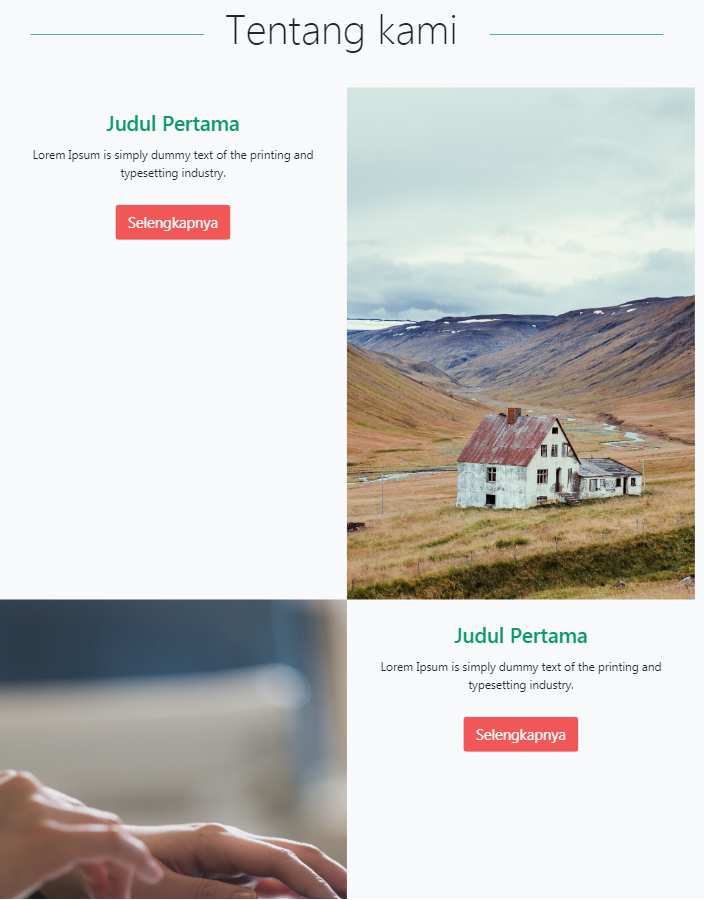

## Styling menu Abut Us dan Menambahkan elemen Lainnya.

Sesuai rencana sebelumnya, pada kesempatan ini kita akan menambahkan style dan juga beberapa elemen pada menu about us.

Pertama-tama kita akan menambahkan elemen-elemen di dalam elemen `<div>` deskripsi ini yah.

```html
<div class="col-12 col-md-6">
   Lorem Ipsum is simply dummy text of the printing and typesetting industry.
</div>
```

Di sini kita akan menampilkan judul, deskripsi dan juga tombol **CTA** (*Call To Action*).

Kita bisa tambahkan elemen `<div>` terlebih dahulu, dan bisa tambahkan style `padding: 15px;`

```html
<div style="padding: 15px;">

 
</div>
```

Kemudian tambahkan elemen untuk membuat judul (judulnya bisa diupdate dengan text yang menarik).

```html
<h3 class="display-5 text-center text-green mt-3 mb-3">Judul Pertama</h3>
```

Lalu buat elemen `<p>` untuk deskripsinya.

```html
 <p style="text-align: justify;">
 Lorem Ipsum is simply dummy text of the printing and typesetting industry. 
</p>
                                 
```

Lalu tambahkan tombol **CTA**.

```html
  <div class="col-12 pt-3 text-center">
    <a class="btn bg-red btn-lg text-white" target="_blank" 
    href="" role="button">Selengkapnya</a>
</div>
```

Lakukan juga pada elemen `div` untuk deskripsi kedua.

Hasilnya menjadi sebagai berikut :

```html
<section id="about"  class="bg-light">>
   <div class="container">
       <h2 class="display-4 text-center mb-5" style="margin-top: 5rem!important;">Tentang kami </h2>  
       <div class="row no-gutters">
        <!--gambar & text pertama-->
         <div class="col-12 col-md-6">
           <div style="padding: 15px;">
             <h3 class="display-5 text-center text-green mt-3 mb-3">Judul Pertama</h3>
             <p style="text-align: justify;">
               Lorem Ipsum is simply dummy text of the printing and typesetting industry.
             </p>
             <div class="col-12 pt-3 text-center">
                <a class="btn bg-red btn-lg text-white" target="_blank" 
                    href="" role="button">Selengkapnya</a>
              </div>            
              </div>
            </div>
           	<div class="col-12 col-md-6">
              <div class=" vh-100 cover" style="background-image: url('images/banner3.jpg');">
              </div>
             </div>
          <!--gambar & teks kedua-->
           <div class="col-12 col-md-6">
             <div class=" vh-100 cover" style="background-image: url('images/banner2.jpg');">
             </div>
            </div>
            <div class="col-12 col-md-6">     
              <div style="padding: 15px;">
                <h3 class="display-5 text-center text-green mt-3 mb-3">Judul Pertama</h3>
                <p style="text-align: justify;">
                  Lorem Ipsum is simply dummy text of the printing and typesetting industry. 
                </p>
                <div class="col-12 pt-3 text-center">
                   <a class="btn bg-red btn-lg text-white" target="_blank" 
                       href="" role="button">Selengkapnya</a>
                </div>            
              </div>
           </div>  
   </div>    
</section>
```



