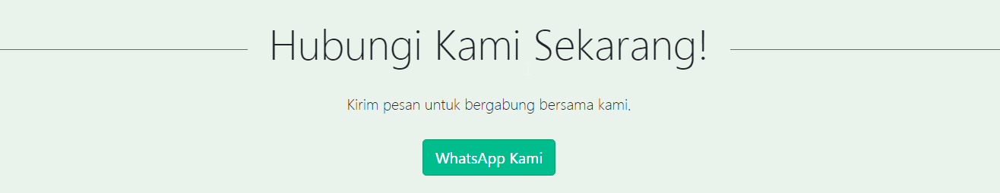

## Membuat Section Contact Us

Kita akan membuat section contact us.

 Tambahkan **class** `container-fluid` pada elemen `section`, dan jika ingin meletakkan semua elemen yang ada di dalam section ini rata tengah, maka tambahkan **class**  `text-center`.

Kalian bisa tambahkan style lain sesuai keinginan dan juga kebutuhan, misal di sini kita tambahkan style `background-color` dan `padding-top`.

```html
<section id="contact" class="container-fluid text-center" style="background-color: #e9f2eb; padding-top: 25px;">
    
</section>
```

Kemudian tambahkan elemen-elemen yang dibutuhkan di section contact us ini, misalkan kita akan tampilkan judul, deskripsi atau pesan dan juga sebua tombol.

Untuk judul menu kita samakan stylenya seperti judul di menu lain.

```html
<h2 class="display-4 pb-4">Hubungi Kami Sekarang!</h2>
```

Kemudian untuk deskripsi kita gunakan elemen `<p>` dan tambahkan **class** `lead` lalu **padding bottom** gunakan `pb-3`.

```html
<p class="lead pb-3">Kirim pesan untuk bergabung bersama kami.</p>
```

Terakhir kita tambahkan tombol , misalkan kita gunakan class sendiri dengan nama `button-primer` dan kita tambahkan `btn-lg`agar button terlihat agak besar, lalu tambahkan `mb-4` untuk mengatur **margin bottom**.

```html
<a href="#" class="btn button-primer btn-lg mb-4">WhatsApp Kami</a>
```

Kode lengkap untuk section contact us menjadi seperti berikut ini.

```html
<section id="contact" class="container-fluid text-center" style="background-color: #e9f2eb; padding-top: 25px;">
     <h2 class="display-4 pb-4">Hubungi Kami Sekarang!</h2>
     <p class="lead pb-3">Kirim pesan untuk bergabung bersama kami.</p>
     <a href="#" class="btn button-primer btn-lg mb-4">WhatsApp Kami</a>
</section>
```

Tampilannya menjadi sebagai berikut :



