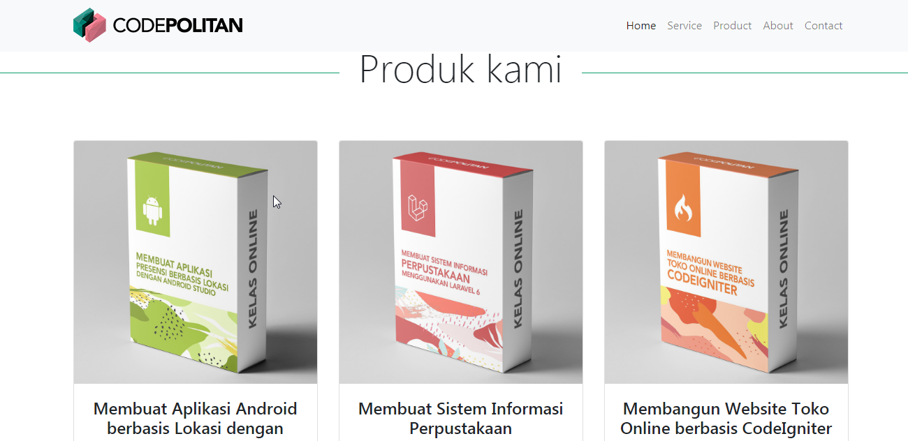

Pada bagian penutup ini kita akan membetulkan beberapa style landing page kita.

Salah satunya adalah mengatur fokus dari masing-masing menu, karena untuk saat ini, ketika kita klik salah satu menu, fokusnya kurang mengarah.

Contoh ketika klik menu service, tampilannya adalah sebagai berikut :


Dan juga ketika klik menu product, tampilannya adalah sebagai berikut :


Nah kita bisa tambahkan style pada judul di service dan product tersebut , menjadi seperti di bawah ini :

```html
<div class="col-12 pb-4">
  <h2 class="display-4 text-center mb-5" style="margin-top: 4rem!important;">
      Mengapa memilih kami?
    </h2>
</div>

```

```html
<div class="col-12 pb-4">
	<h2 class="display-4 text-center mb-5"  style="margin-top: 4rem!important;">
		Produk Kami
	</h2>
</div>
```

**Catatan** : untuk nilai dari margin-top, kalian bisa sesuaikan dengan kebutuhan, misal judul masih belum terlihat, maka harus diubah lagi.

Nah sekarang ketika kita klik menu product dan service, tampilannya menjadi lebih fokus, yaitu sebagai berikut :


Menu Product :




Nah setelah itu kita akan mengatur tampilan layar, karena pada tampilan layarnya terlihat bergeser ke kanan :


Kita bisa mengecilkan style garis pada elemen `<h2>`,  update style `<h2>` sebagai berikut :

```css
h2:before,
h2:after 
{
 background-color: #0b9b6b;
 content: "";
 display: inline-block;
 height: 1px;
 position: relative;
 vertical-align: middle;
 width: 25%;
}
```

Di atas kita update `width` menjadi 25%, sekarang  tampilan layar sudah tidak berlebih.


Nah terakhir, kita akan menambahkan padding pada icon d footer agar tidak terlihat terlalu berdempetan.

```html
<a href="#" class="text-light" style="padding:5px"><i class=" fab fa-facebook"></i></a>
<a href="#" class="text-light" style="padding:5px"><i class="fab fa-twitter"></i></a>
<a href="#" class="text-light" style="padding:5px"><i class="fab fa-instagram"></i></a>
```

Kode footer kita menjadi sebagai berikut :

```html
<footer class="bg-dark">
   <div class="col-lg-12" style="padding:10px">
      <div style="text-align: center;">
        <a href="#" class="text-light" style="padding:5px">
        	<i class=" fab fa-facebook"></i>
       </a>
        <a href="#" class="text-light" style="padding:5px">
        	<i class="fab fa-twitter"></i>
        </a>
        <a href="#" class="text-light" style="padding:5px">
        	<i class="fab fa-instagram"></i>
        </a>
      </div>
      <p class="text-center text-secondary">Copyright &copy Codepolitan 2020</p> 
</footer>
```

Hasilnya menjadi seperti berikut ini :


Kalian bisa mengupdate tampilan untuk landing page sesuai keinginan kalian.